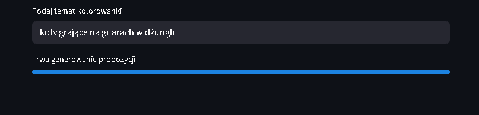
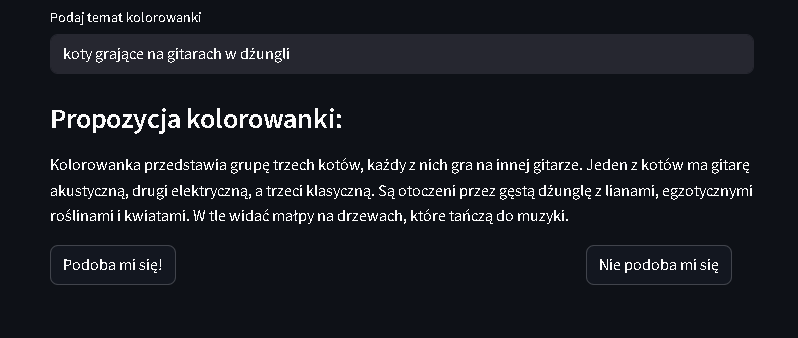
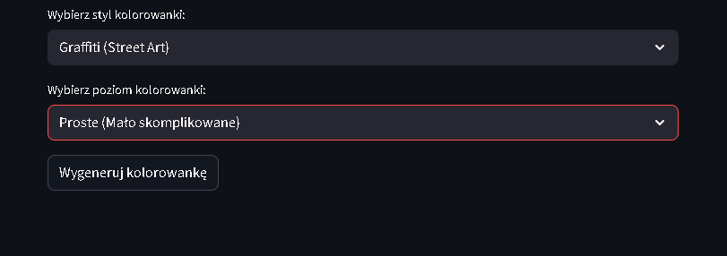
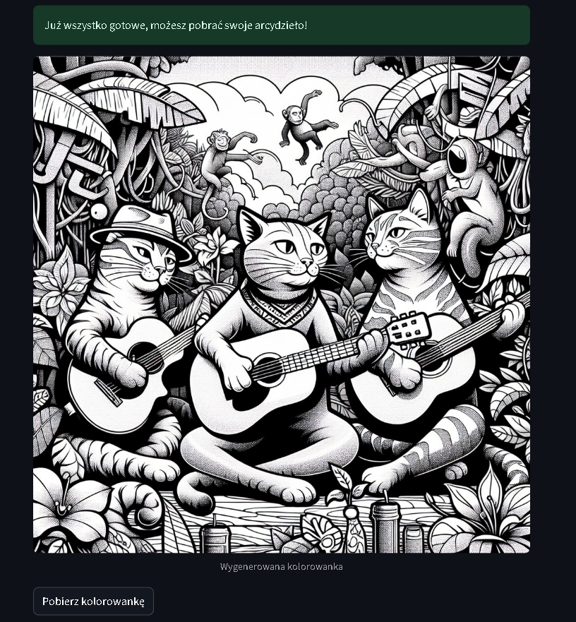
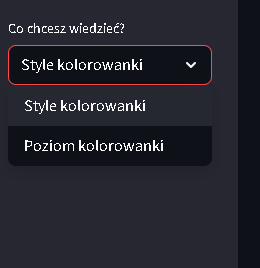
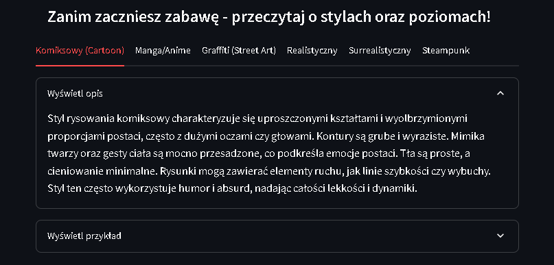

<h1 align="center" style="margin-bottom: 0.2em;">✏️ Pencil Master 📖</h1>
<h2 align="center" style="margin-top: 0;">kreatywna zabawa ze Sztuczną Inteligencją</h2>

# ✏️ **Pencil Master** – kreatywna zabawa ze Sztuczną Inteligencją
Witaj w moim kolejnym projekcie – interaktywnej aplikacji kolorowance opartej na technologii OpenAI! To nie tylko narzędzie do generowania obrazków – to przestrzeń, w której użytkownik wspólnie z AI tworzy wyjątkowe, czarno-białe ilustracje gotowe do pokolorowania 🎨

  <a href="https://pencil-master.streamlit.app/" class="md-button md-button--primary" target="_blank">Zobacz aplikację w nowej karcie</a>

## ✨ **Co potrafi aplikacja?**
- **Twórz własne kolorowanki** – wystarczy wpisać temat (np. „kotki i pieski na nartach”), a AI przekształci Twoją wizję w barwny – choć jeszcze czarno-biały – opis.
- **Styl i poziom trudności do wyboru** – wybierz styl (np. komiksowy, manga, steampunk) i stopień szczegółowości (od bardzo prostego po zaawansowany), by dopasować kolorowankę do siebie lub dziecka.
- **Pełna kontrola** – nie spodobał Ci się pierwszy pomysł AI? Kliknij, by spróbować z innym opisem – aż trafisz w sedno swojej wizji.
- **Gotowe do pobrania** – wygenerowany obrazek możesz od razu pobrać i rozpocząć kolorowanie – na papierze lub cyfrowo.
- **Nowy projekt w każdej chwili** – zaczynasz od nowa jednym kliknięciem.

## 🛠️ **Technologie**
- **Streamlit** – prosty, responsywny interfejs webowy
- **OpenAI API** – generowanie opisów i obrazów
- **Python** – logika aplikacji i przetwarzanie danych

## 🔑 Wymagania
Do korzystania z aplikacji wymagany jest klucz API OpenAI. Dzięki temu możesz tworzyć własne kolorowanki w jakości, która naprawdę zaskakuje.

## 🚀 Jak to działa?

### 1. Wprowadź temat kolorowanki
Użytkownik wpisuje, co chce zobaczyć (np. „koty grające na gitarach w dżungli”).

### 2. Zaakceptuj lub odrzuć propozycję opisu
Kliknij "Podoba mi się" i przejdź do następnego kroku lub "Nie podoba mi się", aby wygenerować nowy opis. 

### 3. Wybierz styl i poziom trudności
Aplikacja pozwala dobrać styl (np. manga, steampunk) oraz poziom detalu.

### 4. Wygeneruj i pobierz obrazek
Po kliknięciu przycisku, AI tworzy kolorowankę gotową do pobrania.

#### 🎉 I gotowe!
Możesz teraz pobrać swoją kolorowankę albo rozpocząć nowy projekt.

### 5. Zajrzyj do zakładki „Style i przykłady”
W lewym górnym rogu znajdziesz zakładkę z dodatkowymi informacjami i przykładami stylów. 

Po wybraniu pokaże Ci się rozwijane menu.

  <em>Utworzono: 2025-06-20</em> 
  © 2025 Mateusz Wilczewski

