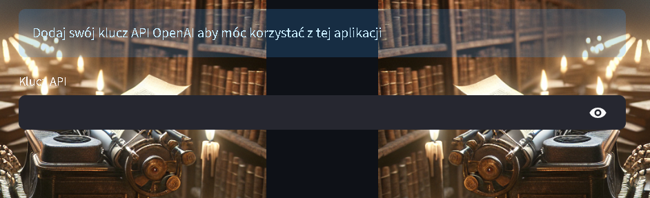
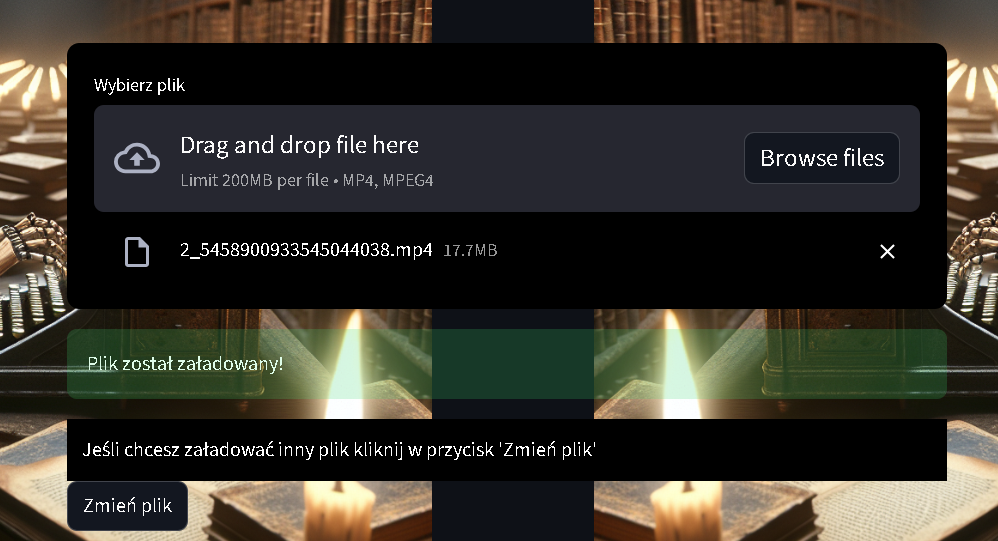
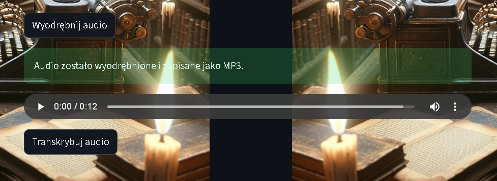
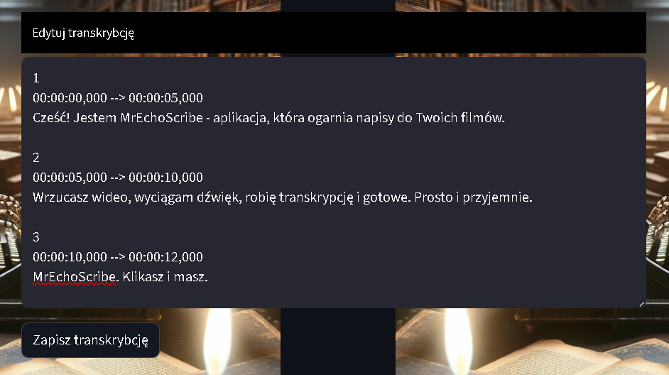
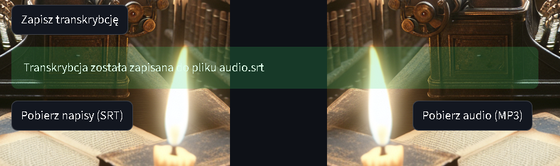

# 🖋️🎬 MrEchoScribe – Twój dżentelmen od napisów filmowych
**MrEchoScribe** to inteligentny asystent, który z gracją i precyzją zamienia dźwięk z filmu na tekst. Potrzebujesz napisów? On już wie, co robić.

  <a href="mr-echo-scribe.streamlit.app/" class="md-button md-button--primary" target="_blank">Zobacz aplikację w nowej karcie</a>

## 🧠 Co potrafi?

**1. Klucz API OpenAI** – to Twoja wejściówka do świata transkrypcji. Wprowadź go, a MrEchoScribe zacznie działać.
2. **Wideo? Poproszę!** – przeciągnij plik (MP4, MPEG4, do 200 MB) i wrzuć go do eleganckiego drop-zone’u.
3. **Wyodrębnij audio** – film to nie tylko obraz. MrEchoScribe wydzieli z niego samą ścieżkę dźwiękową.
4. **Transkrybuj audio** – tekst z dźwięku, błyskawicznie i dokładnie. Dzięki AI, ale z ludzką jakością.
5. **Edytuj** – masz pełną kontrolę. Popraw, dopisz, przesuń. Napisy są Twoje.
6. **Zapisz i pobierz** – napisy w formacie `.srt` i audio w `.mp3` gotowe do pobrania jednym kliknięciem.

## 🎯 Dla kogo?

Dla filmowców, twórców internetowych, edukatorów, tłumaczy, montażystów – wszystkich, którzy chcą, by ich treść była czytelna, dostępna i gotowa na więcej.

---

MrEchoScribe – bo każde echo zasługuje na swój zapis.

## 🎬 Jak to działa?

### 1. Wprowadź swój klucz API OpenAI  
To pierwszy krok. Bez niego MrEchoScribe nie ruszy w świat dźwięków.

---

### 2. Przeciągnij plik wideo (drag & drop)  
Załaduj film w formacie MP4/MPEG4 (do 200MB). Możesz zmienić plik w dowolnym momencie.

---

### 3. Wyodrębnij audio  
Kliknij „Wyodrębnij audio”, a MrEchoScribe z gracją oddzieli dźwięk od obrazu.

---

### 4. Transkrybuj audio / Edytuj napisy
Teraz czas na magię AI. Kliknij „Transkrybuj audio”, a pojawią się napisy – gotowe do edycji.

Nie jesteś zdany tylko na maszynę. Możesz poprawić, dopisać lub przestawić tekst przed zapisaniem.

---

### 5. Zapisz i pobierz  
Zadowolony? Zapisz transkrypcję, a następnie pobierz gotowe pliki:  
🎞️ Napisy `.srt`  
🎧 Audio `.mp3`

---

#### 🎉 Gotowe!
Twój film ma już głos i tekst – elegancko zsynchronizowane.

  <em>Utworzono: 2025-06-21</em> 
  © 2025 Mateusz Wilczewski

