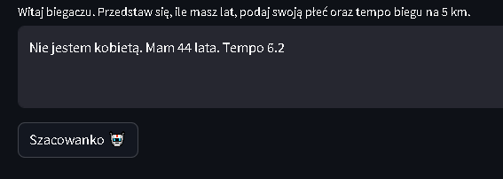
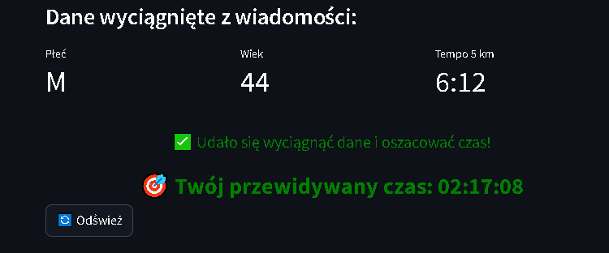
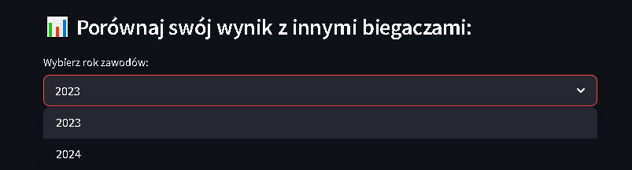
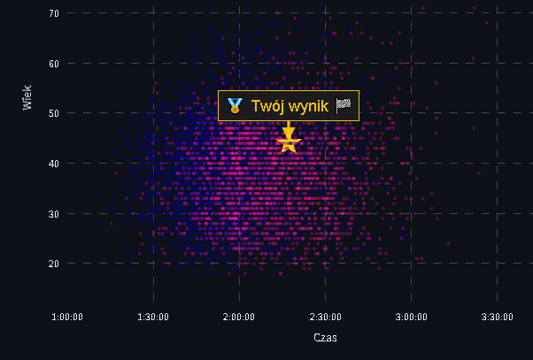

<h1 align="center" style="margin-bottom: 0.2em;">🏃 <strong>RunAlyze AI</strong> 📊</h1>
<h2 align="center" style="margin-top: 0;">Twój osobisty asystent predykcji czasu półmaratonu</h2>

---

<h4 align="center" style="margin-top: 2em; margin-bottom: 0;">Wprowadź dane swojego biegu i zobacz, jak wypadasz na tle tysięcy innych zawodników.</h4>
<h4 align="center" style="margin-top: 0.2em;">Przewiduj – porównuj – analizuj.</h4>

---

  <a href="https://runalyze-ai-app-ezuz7.ondigitalocean.app/" class="md-button md-button--primary" target="_blank">Zobacz aplikację w nowej karcie</a>

---

## 🧠 Co potrafi?

1. **Wprowadź dane ręcznie lub opisowo** – podaj czas, płeć, rok urodzenia albo po prostu opisz bieg – AI wyciągnie potrzebne informacje.
2. **Szybka analiza i predykcja** – aplikacja błyskawicznie szacuje Twój przewidywany czas półmaratonu na podstawie danych historycznych.
3. **Porównanie z innymi** – zobacz, jak Twój wynik wypada na tle tysięcy biegaczy.
4. **Personalizacja** – aplikacja uwzględnia Twój wiek, płeć i dokładny czas.
5. **Estetyczna i funkcjonalna wizualizacja** – Twój wynik wyróżnia się na tle innych dzięki dynamicznej ikonie i opisie.

---

## 🎯 Dla kogo?

Dla biegaczy, trenerów, analityków sportowych i pasjonatów danych – dla każdego, kto chce lepiej zrozumieć swoje osiągi i planować przyszłe starty.

---

<h3 align="center">RunAlyze AI – bo czas ma znaczenie 🕒</h3>

---

## 🛠️ Technologie

- **Python** – język główny aplikacji i analizy danych
- **Streamlit** – szybki framework do budowy aplikacji webowych
- **PyCaret** – silnik predykcyjny oparty na AutoML
- **Pandas / Plotly** – analiza danych i wizualizacja interaktywna
- **OpenAI API** – ekstrakcja danych z opisów tekstowych
- **Langfuse** – monitorowanie interakcji z modelem
- **boto3 / s3fs / fsspec** – obsługa danych z chmury (S3)
- **dotenv** – bezpieczne zarządzanie konfiguracją

---

## 🚀 Jak to działa?

### 1. Wprowadź dane
Wypełnij pole tekstowe – AI wyłapie najważniejsze informacje: czas, płeć, rok urodzenia.

---

### 2. Zobacz predykcję  
Aplikacja porówna Twoje dane z danymi tysięcy biegaczy i oszacuje Twój wynik.

---

### 3. Analizuj na wykresie  
Twój punkt zostanie wyróżniony 🏅 na tle innych uczestników – zobacz, gdzie się znajdujesz.

---

### 4. Eksploruj i porównuj  
Możesz zmieniać dane i sprawdzać, jak wpływa to na przewidywany wynik – idealne do celów treningowych.

---

## 🖼️ Zrzuty ekranu

### 1. Wprowadź dane 📝

*To pierwszy krok. Bez niego RunAlyze AI nie ruszy.*

---

### 2. Analiza i predykcja 🤖

Model uczenia maszynowego błyskawicznie analizuje Twoje dane i przewiduje Twój wynik na podstawie rzeczywistych wyników tysięcy biegaczy.

---

### 3. Twoje miejsce na wykresie 📊

Zobacz swój punkt (🏅) na interaktywnym wykresie. Możesz porównać się z innymi biegaczami w podobnym wieku i tej samej płci.
🎯 Zobacz, czy jesteś bliżej czołówki, czy peletonu!

### 4. Testuj różne scenariusze 🔁
Zmień wiek, czas, płeć albo rok i zobacz, jak zmienia się Twoja pozycja.
Idealne, jeśli chcesz symulować formę, planować progres lub ustalać cele treningowe.

---

## 🧾 Wymagania

- Przeglądarka internetowa (działa na komputerze i mobilnie)
- Brak konieczności logowania

---

  <em>Utworzono: 2025-06-25</em> 
  © 2025 Mateusz Wilczewski

---